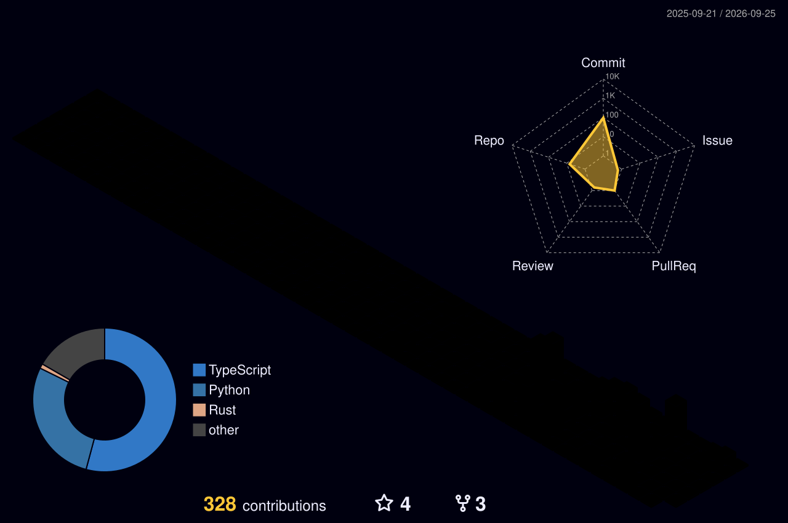

<div align="center">



<a href="https://github.com/6rzan">
  
</a>

<br/><br/>


<br/><br/>

<a href="https://github.com/6rzan?tab=repositories"></a>&nbsp;
<a href="https://www.linkedin.com/in/taha-thabit/"></a>&nbsp;
<a href="mailto:tahafahd40@gmail.com"></a>&nbsp;
<a href="https://github.com/6rzan"></a>

<br/><br/>


</div>


## About

Final-semester Computer Science student at Asia Pacific University (APU), Malaysia. Expected graduation: October 2026.

I am focused on networking, IT support, AI agents, and software development. I am studying CCNA topics now and building toward CCIE-level networking depth over the long term. No certification is claimed on this profile; nothing gets listed until it is earned.

I have internship experience as an IT Trainee at Pacific Inter-Link Sdn Bhd (PIL) in Malaysia, and I actively use AI agents for coding, automation, learning, and technical workflows.

Most repositories here are university projects. They are presented as exactly that: coursework built to learn real-time systems, concurrency, and software engineering, not commercial products.

<div align="center">

| Focus Area | Direction |
|:---|:---|
| Networking | CCNA study now, CCIE-level depth as the long-term goal |
| IT Support | Troubleshooting, end-user support, clear documentation |
| AI Agents | Agents for coding, automation, and IT support workflows |
| Software Development | University projects in Rust, Java, Python, and C++ |
| Linux & Servers | Command-line work, server basics, VM lab practice |
| Automation | Scripting repetitive technical work away |

</div>


## Open To

<div align="center">


</div>


## Education

**BSc Computer Science · Asia Pacific University (APU), Malaysia**

Final Semester · Expected Graduation: October 2026 · Major: Computer Science

Academic focus:

- Real-time systems: measurement-driven work on latency, jitter, and scheduling behavior
- Concurrent programming: multi-stage pipelines built with Java concurrency tools
- Software engineering coursework and team-based application projects
- Networking fundamentals studied alongside the degree (CCNA track)
- Linux, Git, and command-line tooling as the everyday workflow

<div align="center">


</div>


## Tech Stack

<div align="center">

**Languages**


**Frontend**


**Backend & Databases**


**Networking, Systems & Tooling**


**Study Tracks & Lab Practice**


</div>


## AI / ML & Agentic AI Focus

<div align="center">

| Domain | Level | Details |
|:---|:---|:---|
| AI Agents | Hands-on | Active use of AI agents for coding, debugging, and task automation |
| Agentic AI | Active learning | Multi-step agent workflows: planning, tool use, and execution |
| Kaggle AI Agents Intensive | Participant | [5-Day AI Agents Intensive Vibecoding Course with Google](https://www.kaggle.com/competitions/5-day-ai-agents-intensive-vibecoding-course-with-google) |
| Prompt Engineering | Practical | Structured prompting for repeatable coding and troubleshooting output |
| IT Support Agents | Concept work | Applying agents to help desk and support-style workflows |
| AI Tooling | Active use | AI-assisted development, scripting, and documentation |
| Machine Learning Basics | Foundational | Core ML concepts at university coursework level |
| Automation | Practical | Scripts and agent-driven automation on Linux |

</div>


## Featured Projects

All five are university projects and are presented as coursework.

<details>
<summary><b>Real-Time-System-project</b> · Rust real-time data ingestion and analytics pipeline</summary>

<br/>

University Real-Time Systems project. A Rust pipeline that ingests the live Wikipedia Recent Changes SSE stream and compares Tokio async/await against `std::thread` execution under identical input.

| Aspect | Detail |
|:---|:---|
| **Stack** | Rust · Tokio · `std::thread` · Criterion · Python plotting · Linux |
| **Scale** | Single-machine pipeline running on a live public event stream |
| **Performance** | Measures latency, jitter, scheduling drift, synchronization throughput, and runtime behavior |
| **Security** | Read-only consumption of a public data stream · academic scope |
| **Impact** | Coursework: a measured comparison of async and threaded runtimes |
| **Repository** | [github.com/6rzan/Real-Time-System-project](https://github.com/6rzan/Real-Time-System-project) |

The same workload runs on both execution models so the numbers are directly comparable. Criterion handles benchmarking and a Python step plots the results.

</details>

<details>
<summary><b>SwiftCart-CPP</b> · Java warehouse order fulfillment simulation</summary>

<br/>

Java-based warehouse order fulfillment simulation built for a Concurrent Programming module. It models order intake, picking, packing, labelling, sorting, loading, and truck dispatch using Java concurrency tools.

| Aspect | Detail |
|:---|:---|
| **Stack** | Java · Maven · `java.util.concurrent` |
| **Scale** | Local simulation of a multi-stage fulfillment pipeline |
| **Performance** | Concurrency-focused: coordinated stages without race conditions, correctness over raw throughput |
| **Security** | Not applicable · local academic simulation |
| **Impact** | Coursework: `java.util.concurrent` applied to a realistic pipeline |
| **Repository** | [github.com/6rzan/SwiftCart-CPP](https://github.com/6rzan/SwiftCart-CPP) |

Each stage of the order flow runs concurrently and hands work to the next stage through Java concurrency primitives. The implementation is Java despite the repository name.

</details>

<details>
<summary><b>Deliverly-app-jv</b> · University food delivery application (team project)</summary>

<br/>

University food delivery application built as a team. My contribution covered the delivery runner and vendor functions. Other team members built the login, admin, manager, and customer functions.

| Aspect | Detail |
|:---|:---|
| **Stack** | Java-based university application project |
| **Scale** | Team coursework application |
| **Performance** | Standard university application scope |
| **Security** | Not a project focus · academic scope |
| **Impact** | Team coursework: my work is the runner and vendor side of the app |
| **Repository** | [github.com/6rzan/Deliverly-app-jv](https://github.com/6rzan/Deliverly-app-jv) |

Listed for the parts I wrote, not the full system.

</details>

<details>
<summary><b>Aetheria_The-Last-Stand.pygame</b> · Python/Pygame tower-defense game</summary>

<br/>

Python/Pygame tower-defense game. The player protects the Heartcrystal from enemy waves by placing magical towers with different attack styles.

| Aspect | Detail |
|:---|:---|
| **Stack** | Python · Pygame |
| **Scale** | Single-player desktop game |
| **Performance** | Runs as a local desktop game · performance tuning was not the goal |
| **Security** | Not applicable · offline game |
| **Impact** | Coursework: Python and Pygame practice through a complete playable game |
| **Repository** | [github.com/6rzan/Aetheria_The-Last-Stand.pygame](https://github.com/6rzan/Aetheria_The-Last-Stand.pygame) |

Covers wave spawning, tower placement, and per-tower attack behavior.

</details>

<details>
<summary><b>ISE-Assignment</b> · University module assignment</summary>

<br/>

University assignment repository, kept public as part of the academic record. Coursework, not a product.

| Aspect | Detail |
|:---|:---|
| **Stack** | As documented in the repository |
| **Scale** | Module assignment |
| **Performance** | Not applicable |
| **Security** | Not applicable |
| **Impact** | Coursework |
| **Repository** | [github.com/6rzan/ISE-Assignment](https://github.com/6rzan/ISE-Assignment) |

Included for completeness and honesty about what the profile contains.

</details>


## Experience

### IT Trainee · Pacific Inter-Link Sdn Bhd (PIL)

**Malaysia**

Internship inside a corporate IT environment, working with the IT team on day-to-day support and operations.

Scope of work:

- Assisted with end-user IT support and troubleshooting of hardware and software issues
- Helped with device setup, maintenance, and routine IT operations tasks
- Worked around corporate network and infrastructure environments
- Documented recurring issues and their fixes for reuse


### Computer Science Student · Asia Pacific University (APU)

**Final Semester · Expected Graduation: October 2026**

Academic scope:

- Built and benchmarked a Rust real-time data pipeline comparing async and threaded execution
- Implemented a concurrent warehouse fulfillment simulation in Java
- Contributed the delivery runner and vendor functions to a team food delivery application
- Developed a Python/Pygame tower-defense game
- Studying networking fundamentals (CCNA topics) alongside coursework


## Achievements

<div align="center">

| Recognition | Details |
|:---|:---|
| Final-Semester CS Student | BSc Computer Science at Asia Pacific University, Malaysia |
| Expected Graduation | October 2026 |
| Industry Exposure | IT Trainee at Pacific Inter-Link Sdn Bhd, Malaysia |
| Networking Study Track | CCNA topics in progress, CCIE-level depth as the long-term goal |
| AI Agent Focus | Practical use of AI agents for coding, automation, and IT workflows |
| Kaggle AI Agents Intensive | Participant in the 5-Day AI Agents Intensive Vibecoding Course with Google |
| Academic Project Builder | Five university repositories across Rust, Java, and Python |
| Real-Time Systems Practice | Rust pipeline benchmarking async against threaded execution |
| Concurrent Programming Practice | Java warehouse simulation with `java.util.concurrent` |

</div>


## Certifications

**Certifications: None Claimed Yet.**

No completed certification is listed on this profile. Credentials appear here only after they are earned and verifiable.

### Cisco Study Track

| Track | Status |
|:---|:---|
| CCNA | Studying: routing, switching, IP addressing, subnetting, core network services |
| CCIE-Level Depth | Long-term track · a multi-year goal, not a claimed credential |

### AI Programs

| Program | Status |
|:---|:---|
| [Kaggle 5-Day AI Agents Intensive with Google](https://www.kaggle.com/competitions/5-day-ai-agents-intensive-vibecoding-course-with-google) | Participant |


## Coding Profiles

<div align="center">

<a href="https://github.com/6rzan"></a>&nbsp;
<a href="https://www.kaggle.com/tahafahdthabit"></a>&nbsp;
<a href="https://github.com/6rzan?tab=repositories"></a>

</div>


## GitHub Analytics

<div align="center">


<br/><br/>


<br/><br/>


</div>


## 3D Contributions

<div align="center">



</div>


## Contribution Snake

<div align="center">


</div>


## Pac-Man Contributions

<div align="center">


</div>


## Current Focus

```yaml
learning:
  - "CCNA topics: routing, switching, IP addressing, subnetting"
  - "Long-term track: CCIE-level networking concepts"
  - "Linux servers: services, users, troubleshooting"
  - "Documentation habits: writing down what broke and how it was fixed"

building:
  - "AI agent workflows for coding, automation, and IT support"
  - "Networking labs: simulator and VM-based practice topologies"
  - "Final-semester university coursework and projects"

exploring:
  - "AI-assisted IT support and help desk concepts"
  - "Server administration and self-hosted tooling"

open_to:
  - "Graduate IT roles after October 2026"
  - "IT support and networking internships"
  - "AI agent project collaboration"
```


## Connect

<div align="center">

<a href="mailto:tahafahd40@gmail.com"></a>&nbsp;
<a href="https://www.linkedin.com/in/taha-thabit/"></a>&nbsp;
<a href="https://www.kaggle.com/tahafahdthabit"></a>&nbsp;
<a href="https://github.com/6rzan"></a>&nbsp;
<a href="https://github.com/6rzan?tab=repositories"></a>

</div>


<div align="center">

**Build useful systems. Learn the fundamentals. Keep building.**


</div>
