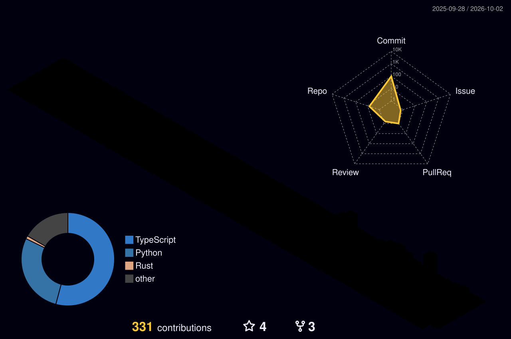

&nbsp;
&nbsp;
&nbsp;

## About

I fix laptops and network problems, build software, and deal with customers every day. My IT support experience comes from a corporate internship at Pacific Inter-Link. For nearly three years I have also worked part-time for a co-living rental business, where I handle tenants, viewings, rent and renovation work. I build full-stack and AI applications in TypeScript, Python, Java and Rust.

I finished my Computer Science studies at Asia Pacific University (APU) in 2026; the degree certificate is pending.

## Experience

**Property & Tenant Manager (part-time)** · Homely Co Living · *Nov 2023 – present*

- Look after tenants for a co-living business with more than 10 units: enquiries, viewings, move-ins, rent, deposits and day-to-day issues.
- List rooms online, run viewings and close rentals.
- Get units ready to live in by doing the renovation myself: demolition (hacking), painting and general work. Arrange repairs with contractors.

**IT Trainee** · Pacific Inter-Link Sdn Bhd, Kuala Lumpur · *Sep 2025 – Jan 2026*

- Supported staff with hardware, software and network connectivity issues; set up laptops and applied security patches.
- Traced CPU throttling on two laptops to overheating and fixed both with thermal cleaning.
- Helped with switch port checks, cable mapping and equipment relocation.

## Featured Projects

| Project | What it is | Stack |
| --- | --- | --- |
| [AI Help Desk Agent](https://github.com/6rzan/ai-helpdesk-agent) | Final Year Project. Turns a plain-language IT problem into a classified ticket with step-by-step troubleshooting. Automated fixes run only from a default-deny whitelist, with user consent, staff approval for changes and an audit trail. | TypeScript, React, Express, MongoDB |
| [The Council](https://github.com/6rzan/The-Council) | Multi-agent app: recruits an expert panel, debates a question, fact-checks claims against Wikipedia through MCP and streams a cited verdict. 79 offline tests. | Python, Google ADK, MCP |
| [Real-Time Data Pipeline](https://github.com/6rzan/Real-Time-System-project) | The live Wikipedia Recent Changes stream processed in Tokio async and in standard threads, benchmarked on tail latency and jitter. Zero-copy parsing cut parser heap usage about 60 times. | Rust, Tokio, Criterion |
| BridgeAbility *(private, team of 4)* | Booking platform for accessibility services in Malaysia. I built the requester side; it runs on Elastic Beanstalk with RDS, DynamoDB and S3. | Node.js, Express, AWS |
| [SwiftCart](https://github.com/6rzan/SwiftCart-CPP) | Warehouse simulation: 600 orders through concurrent picking, packing and dispatch stages. Written in Java despite the repo name. | Java |
| [Aetheria: The Last Stand](https://github.com/6rzan/Aetheria_The-Last-Stand.pygame) | Tower-defence game with enemy waves and three tower types. | Python, Pygame |

## Tech Stack

- **IT support:** hardware and software troubleshooting, laptop setup, security patching, connectivity checks, cable mapping
- **Networking:** switching, STP, LAG, routing basics, subnetting
- **AI:** LLM apps, multi-agent systems, MCP, Ollama, n8n

## Training and Certifications

| Training | Provider | Date |
| --- | --- | --- |
| [Cloud Developing](https://www.credly.com/go/c2DnqaSJ), 40-hour training badge | AWS Academy | Oct 2026 |
| [Cloud Foundations](https://www.credly.com/go/avk9GYYT), 20-hour training badge | AWS Academy | Oct 2026 |
| Introduction to Cybersecurity | Cisco Networking Academy | Oct 2026 |
| [AI Fluency for Builders](https://academy.claude.com/verify/9021f08cfe7353f17026bd81976d15bd) | Claude Academy | Oct 2026 |
| [AI Fluency: Framework and Foundations](https://academy.claude.com/verify/a688879ae943435b3881e766de5fcb7e) | Claude Academy | Oct 2026 |
| [Building Effective Human-Agent Teams](https://academy.claude.com/verify/a8fe42ed0f7d541d424edfb9cbadf369) | Claude Academy | Oct 2026 |
| 5-Day AI Agents: Intensive Vibe Coding Course, badge | Kaggle and Google | Jul 2026 |
| [Memory for AI Applications](https://www.credly.com/go/dNSUArpT) | MongoDB | Jun 2026 |
| Red Hat System Administration I (RH124), certificate of attendance | Red Hat course, APIIT | Jan 2025 |

## GitHub Activity

<b>More contribution art</b>

 

